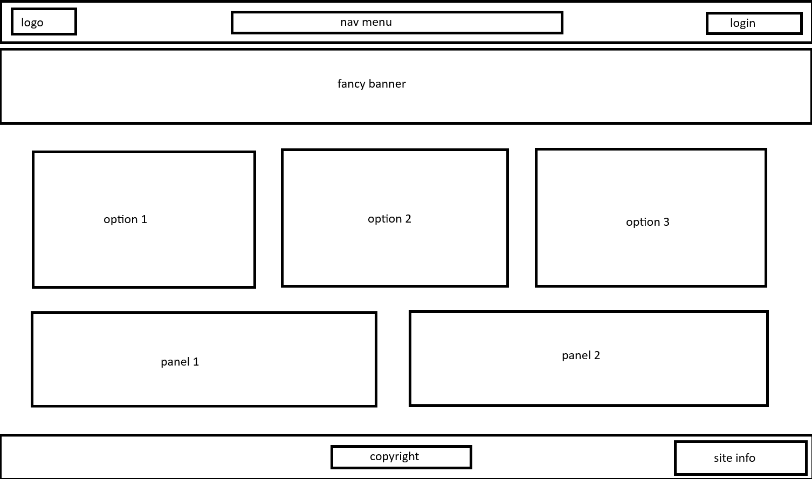

# SCP fan site.

## Design.

I used flex, a lot, because it was just the easiest option, the layouts of each page is designed with the idea of presenting information first over flashy bells and whistles.

For the color scheme i went with a very muted dark theme, easy on the eyes and looks good, each page is littered with dashed borders to give the page some visual structure.

## structure.

The structure for the site was a mock SCP site for employees of the foundation, with that in mind i tried to imagine what a site like that would be like.

I used flex because it lends itself well to sites that are all about information by allowing me to quickly and neatly organise blocks or cards where
i needed them to be.

### Live link to site

[tiny-b.github.io/scp-fansite](https://tiny-b.github.io/scp-fansite/index.html)

